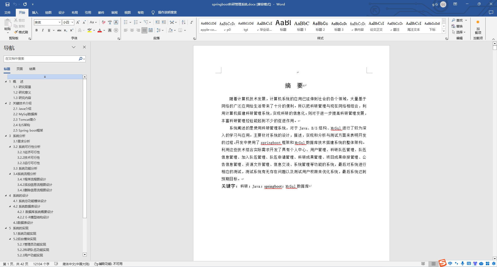
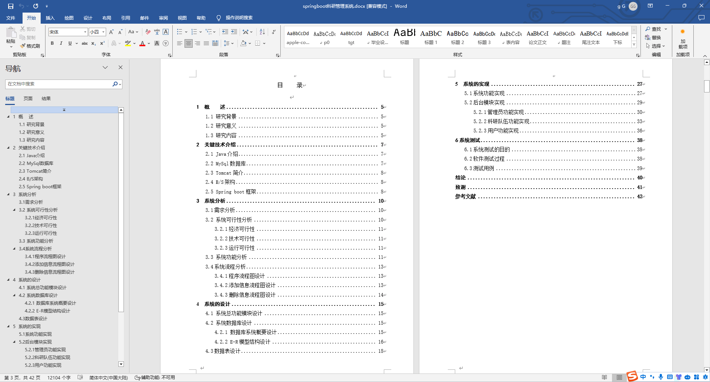
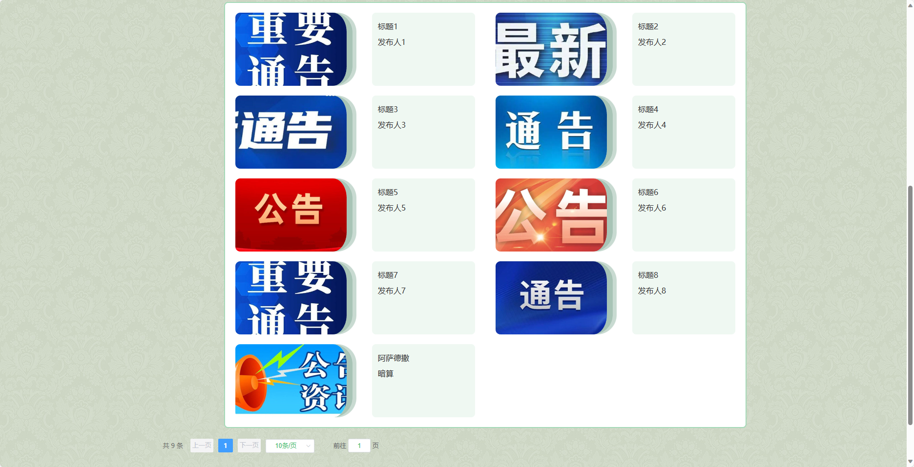
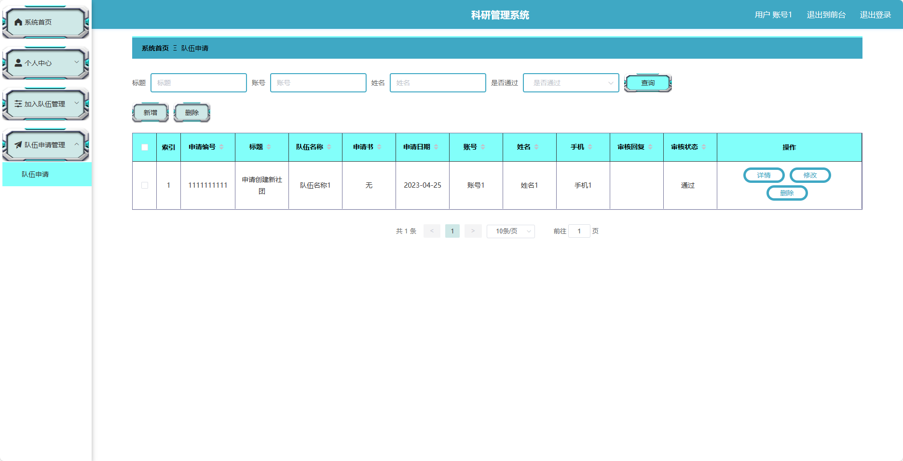
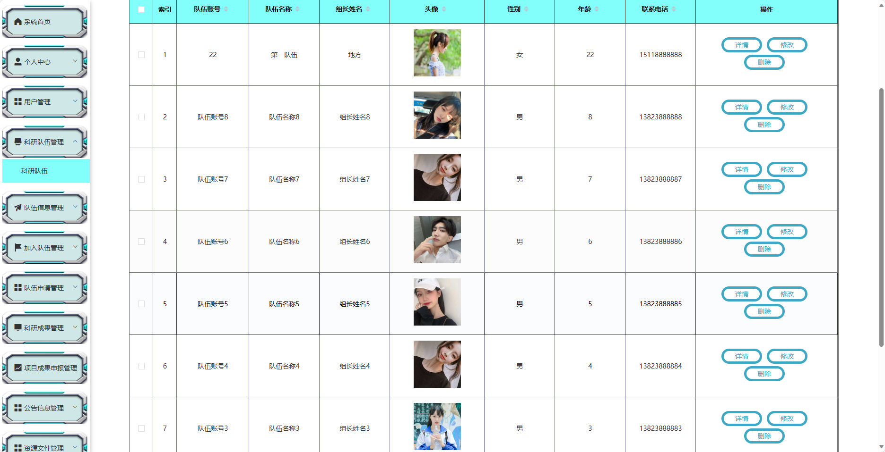
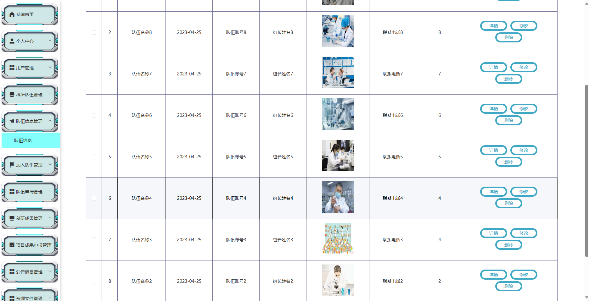
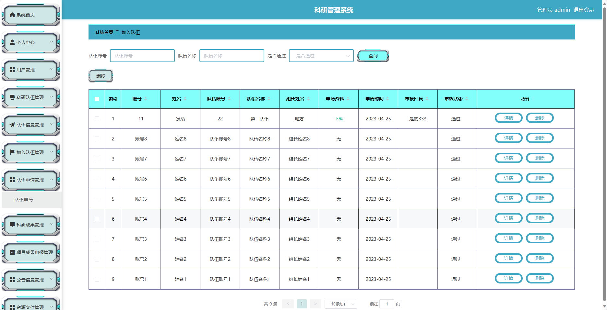

基于SpringBoot的科研管理系统（程序+论文）
=
- 完整代码获取地址：从戎源码网 ([https://armycodes.com/](https://armycodes.com/))
- 作者微信：19941326836  QQ：952045282 
- 承接计算机毕业设计、Java毕业设计、Python毕业设计、深度学习、机器学习
- 选题+开题报告+任务书+程序定制+安装调试+论文+答辩ppt 一条龙服务
- 所有选题地址https://github.com/nature924/allProject

一、项目介绍
---
基于Spring Boot框架实现的科研管理系统，系统包含三种角色：管理员、科研队伍、用户,系统分为前台和后台两大模块，主要功能如下。

### 前台：

1. 首页：展示科研管理系统的概览信息。
2. 队伍信息：展示科研队伍的相关信息。
3. 科研成果：展示科研成果的详细信息。
4. 公告信息：提供关于科研活动的最新公告和通知信息。
5. 资源文件：提供科研相关的文件资源下载。
6. 信息交流：提供用户之间的科研交流平台，包括讨论区、留言板等。
7. 个人中心：用户可以管理个人信息，包括修改密码、查看队伍、查看成果等操作。

### 后台：

### 管理员：
1. 个人中心：管理员可以管理个人信息，包括修改密码等操作。
2. 用户管理：管理员可以管理用户信息，包括查看用户列表、添加、编辑、删除等操作。
3. 科研队伍管理：管理员可以管理科研队伍的信息，包括查看队伍列表、添加、编辑、删除等操作。
4. 队伍信息管理：管理员可以管理队伍的详细信息，包括编辑队伍介绍、添加、删除成员等操作。
5. 加入队伍管理：管理员可以管理用户对队伍的加入申请，包括查看申请列表、审批申请等操作。
6. 科研成果管理：管理员可以管理科研成果的信息，包括查看成果列表、添加、编辑、删除等操作。
7. 项目成果申报管理：管理员可以管理项目成果的申报信息，包括查看申报列表、审批申报等操作。
8. 公告信息管理：管理员可以管理系统的公告信息，包括添加、编辑、删除等操作。
9. 资源文件管理：管理员可以管理系统的资源文件，包括上传、下载、删除等操作。
10. 信息交流：管理员可以管理用户之间的交流信息，包括查看留言、删除留言等操作。
11. 系统管理：管理员可以管理系统的参数设置、日志查看等功能。

### 用户：
1. 个人中心：用户可以管理个人信息，包括修改密码等操作。
2. 加入队伍管理：用户可以申请加入科研队伍，并查看申请状态。
3. 队伍申请管理：用户可以查看自己对科研队伍的申请状态。
4. 科研成果管理：用户可以提交自己的科研成果信息。
5. 项目成果申报管理：用户可以申报项目成果，查看申报状态。
6. 公告信息管理：用户可以查看系统的公告信息。
7. 资源文件管理：用户可以上传、下载科研相关的资源文件。
8. 信息交流：用户可以参与科研交流，包括发表讨论、留言等操作。

### 科研队伍：
1. 个人中心：科研队伍成员可以管理个人信息，包括修改密码等操作。
2. 队伍信息管理：科研队伍成员可以编辑队伍介绍、添加、删除队伍成员等操作。
3. 加入队伍管理：科研队伍成员可以查看用户对队伍的加入申请，并进行审批操作。
4. 科研成果管理：科研队伍成员可以管理科研成果的信息，包括添加、编辑、删除等操作。
5. 项目成果申报管理：科研队伍成员可以查看项目成果的申报情况，并进行审批操作。
6. 公告信息管理：科研队伍成员可以查看系统的公告信息。
7. 资源文件管理：科研队伍成员可以上传、下载科研相关的资源文件。

二、项目技术
---
- 编程语言：Java
- 数据库：MySQL
- 项目管理工具：Maven
- 前端技术：VUE、HTML、Jquery、Bootstrap
- 后端技术：Spring、SpringMVC、MyBatis

三、运行环境
---
- 操作系统：Windows、macOS都可以
- JDK版本：JDK1.8以上都可以
- 开发工具：IDEA、Ecplise、Myecplise都可以
- 数据库: MySQL5.7以上都可以
- Tomcat：任意版本都可以
- Maven：任意版本都可以

四、运行截图
---
### 论文截图：

### 程序截图：

